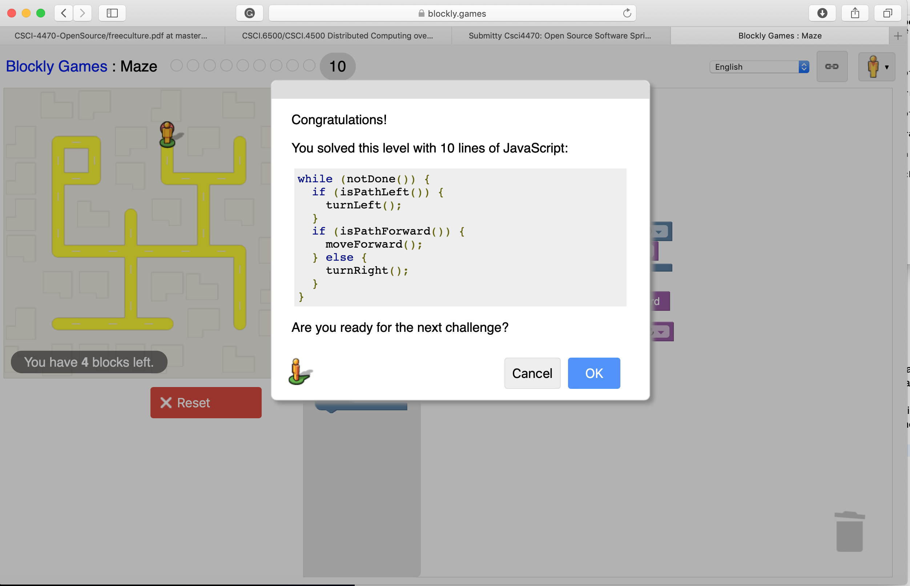

# Lab 01 Report - Introduction to Open Source Software

## 0. Join the Discord if you haven't already

Photo of discord channel 

## 1. Create and setup a Github account

## Name: Steven(Ruizhe) Li -
### email: lir7@rpi.edu
### github account: ez-ant
### discord handle: popwolfer

Photo of Steven Li  

## 2. Reading assignments

### Suggestions for How to Answer Questions in a Helpful Way:
1. Before you ask a question in the forum, make sure you search about your question in the forum. If you find out a similiar posts before, try the solutions in that form. If this do not solve your problem, add this to your posts to avoid others sending you the past link again.
2. Saying something is trash may indeed bring you a lot of ideas. For example, if you say linux is the worst operation system because A is not working, many people would come to you and "teach" you how to use A in linux. Although most people are likely to be rude, they give you many hints to solve the problem. 

### Free Culture 
Jesse's engine is a search engin built for the RPI network. It was made by Jesse based on the Microsoft file-sharing system. He was lawsuited for making a modication and create Jesse's engine. Even if he is possible to win the lawsuit, he need to pay a lot of money and go bankrupt. In the end, he choose to give up the fight. That's probably why we need open source software. If a software is not open sourced, other people would not want to modify it since nobody want to get charged. An open source software would encourage other people to modify the code and work together. In the book, it says that even a student could fix the bugs in Microsoft file-sharing system. With lots of people working in the same open-sourced software, bugs would be easily find out and then quickly resolved.

## Linux

OSX: 

Ubuntu: 

## Regex

Regular Expression: 

Crossword: 

## Play with Snap or Blockly
Photo of Blockly 

## Reflections
I would like to choose RPI population checker. This is an open source project which tracks the population in RPI and show it in the RPI campus map. However, this project is not well-developed now. Several problems need to be addressed in order to make this project usable. First, this project only include part of the buildings in the campus, it does not include dining halls and dormrooms. Second, the population's data is not accurate. Although developer's team got many ideas on how to collect data, collecting data is still difficult. For now, this software can only show the campus population with the given input data.
