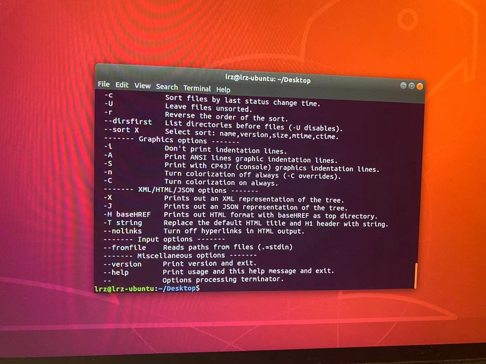

# Lab 01 Report - Introduction to Open Source Software

## Name: Steven(Ruizhe) Li -
### email: lir7@rpi.edu
### github account: ez-ant
### discord handle: popwolfer

Photo of Steven Li  

Photo of discord channel 

## Reading assignments

Suggestions for How to Answer Questions in a Helpful Way:
1. Before you ask a question in the forum, make sure you search about your question in the forum. If you find out a similiar posts before, try the solutions in that form. If this do not solve your problem, add this to your posts to avoid others sending you the past link again.
2. Saying something is trash may indeed bring you a lot of ideas. For example, if you say linux is the worst operation system because A is not working, many people would come to you and "teach" you how to use A in linux. Although most people are likely to be rude, they give you many hints to solve the problem. 

## Linux
OSX: 

Ubuntu: 

## Play with Snap or Blockly
Photo of Blockly 

## Reflections
