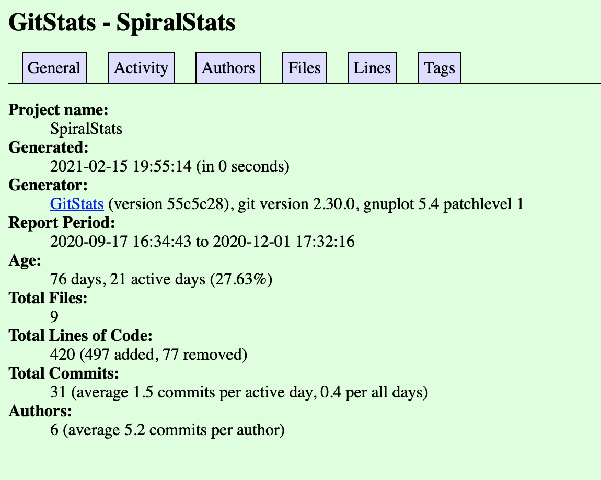

# Lab 03 Report - 

## Part 1

2. link to wiki page: https://github.com/ez-ant/oss-repo-template/wiki/Project-interest

3. screenshots of two formulae
  

  

4. screenshot of matrix

## Part 2

4.
### Project 1: Submitty

###### the number of contributors: 129 contributors
###### number of lines of code: 701982 lines in total
###### the first commit:

commit d81d95fb1a40065889567e084fcb6bf92ff7cace
Author: Jesse Freitas <freitas.jesse@gmail.com>
Date:   Fri Jan 31 21:28:33 2014 -0500

init commit

###### the latest commit: 

commit b93e67822b7750001c9f217f5bb0e9a536e51ac5 (HEAD -> master, origin/master, origin/HEAD)
Author: dependabot[bot] <49699333+dependabot[bot]@users.noreply.github.com>
Date:   Fri Feb 12 12:36:52 2021 -0500

[DevDependency] Bump phpstan/phpstan from 0.12.73 to 0.12.75 in /site (#6197)

Bumps [phpstan/phpstan](https://github.com/phpstan/phpstan) from 0.12.73 to 0.12.75.
- [Release notes](https://github.com/phpstan/phpstan/releases)
- [Commits](https://github.com/phpstan/phpstan/compare/0.12.73...0.12.75)

Signed-off-by: dependabot[bot] <support@github.com>

Co-authored-by: dependabot[bot] <49699333+dependabot[bot]@users.noreply.github.com>

###### the current branches: 131 branches

### Project 2: SpiralStats

###### the number of contributors: 5 contributors
###### number of lines of code: 432 lines in total
###### the first commit:

commit 79fbe80bc867c19791a9df854e6c600097ed751f
Author: schnur <44041333+schnur@users.noreply.github.com>
Date:   Thu Sep 17 16:34:43 2020 -0400

Initial commit

###### the latest commit: 

commit 9432f976a2c7ac457cfbca7915cb630b29d64e68 (HEAD -> master, origin/master, origin/HEAD)
Author: cwramsdell <44122243+cwramsdell@users.noreply.github.com>
Date:   Tue Dec 1 17:32:16 2020 -0500

Update app.py

###### the current branches: 7 branches

### Project 3: SMAB

##### Number of contributors: 3
##### Lines of code: 1606
##### First commit: d6eb67161dade78a5237a4b6cf7a109fedb74387
##### Latest commit: f099ec61dc7a58080079a32e48e05a8d96bae991
##### Branches:
- master
- Class-Files
- URLtraverseandJSON
- User-Interface
- rmupdate
- smartrider

### Project 4: smartrider

##### Number of contributors: 13
##### Lines of code: 301774
##### First commit: 8ed5ddec0cbf3762876a175d85bdd2df9d10e38a
##### Latest commit: 52fb1802d5c71b522eabee04bc37f5c31bda8014
##### Branches:
- master
- bigger-dev
- documentation
- feature-onboarding
- profile-page
- axios-0.21.1
- date-and-time-0.14.2
- ini-1.3.8

5. 

The number of authors on gitstats is slightly larger than the contributors on github. 

On gitstats, the total number of code = code added - code deleted. But on git log, it only shows the added code. Therefore the corresponding result is far more than code calculated on gitstats.

The gitstats show the commits and activities by chart, but it does not show the number of branches of the project.

gource of submitty:

gource of spiralstats:

gource of smartrider:

gource of smab:

