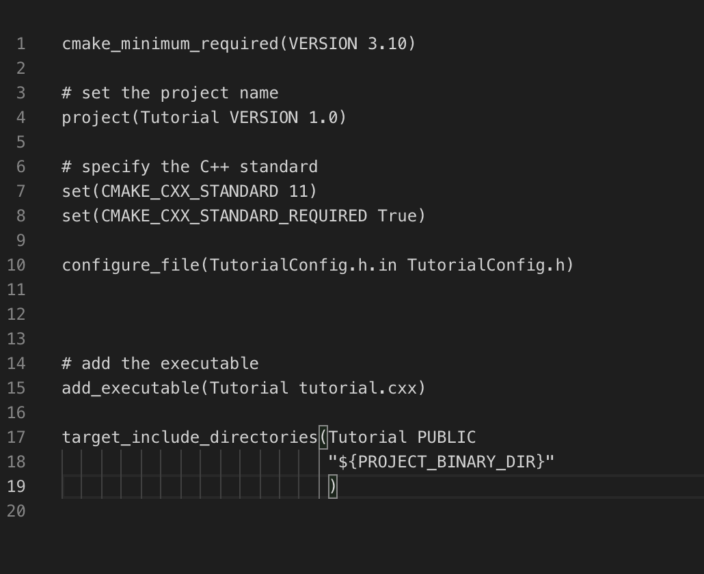

# Lab 04 Report - 

## Part 1

### Step 1. 

###### Output with different inputs: 
  

###### Code:

1. CMakeLists.txt:

2. TutorialConfig.h.in: 

3. Tutorial.cxx:

### Step 2.

###### Output with different inputs: 

  

###### Code:

1. CMakeLists.txt(top level):

2. CMakeLists.txt(in MathFunctions folder):

3. TutorialConfig.h.in: 

4. Tutorial.cxx:

### Step 3.

###### Outputs with different inputs: 

  

###### Code:

1. CMakeLists.txt(top level):

2. CMakeLists.txt(in MathFunctions folder):

### Step 4.

###### Output: 

  
  
  

###### Code:

1. CMakeLists.txt(top level):

2. CMakeLists.txt(in MathFunctions folder):

### Step 5.

###### Output: 

###### Code:

1. CMakeLists.txt(top level):

2. CMakeLists.txt(in MathFunctions folder):

## Part 2

##### Compare Results:

##### Makefile(mine):
all: dynamic_block static_block

static_block: program.o static_lib.a
cc program.o static_lib.a -o static_block -Wl, -rpath .
dynamic_block: program.o share_lib.so
cc program.o share_lib.so -o dynamic_block -Wl, -rpath .
share_lib.so: block.o
cc -shared -o share_lib.so block.o
static_lib.a: block.o
ar qc static_lib.a block.o
block.o: source/block.c
cc -fPIC -c source/block.c -o block.o
program.o: program.c
cc -fPIC -c program.c -o program.o

##### CMakeLists:
cmake_minimum_required(VERSION 3.10)

project(Lab)

set(CMAKE_CXX_STANDARD 11)
set(CMAKE_CXX_STANDARD_REQUIRED True)

add_library(staticLib STATIC source/block.c)
add_executable(static_block program.c)
target_link_libraries(static_block staticLib)

add_library(dynamicLib SHARED source/block.c)
add_executable(dynamic_block program.c)
target_link_libraries(dynamic_block dynamicLib)

##### Outputs:

##### Makefile(generated by cmake):
'''
# CMAKE generated file: DO NOT EDIT!
# Generated by "Unix Makefiles" Generator, CMake Version 3.19

# Default target executed when no arguments are given to make.
default_target: all

.PHONY : default_target

# Allow only one "make -f Makefile2" at a time, but pass parallelism.
.NOTPARALLEL:

#=============================================================================
# Special targets provided by cmake.

# Disable implicit rules so canonical targets will work.
.SUFFIXES:

# Disable VCS-based implicit rules.
% : %,v

# Disable VCS-based implicit rules.
% : RCS/%

# Disable VCS-based implicit rules.
% : RCS/%,v

# Disable VCS-based implicit rules.
% : SCCS/s.%

# Disable VCS-based implicit rules.
% : s.%

.SUFFIXES: .hpux_make_needs_suffix_list

# Command-line flag to silence nested $(MAKE).
$(VERBOSE)MAKESILENT = -s

#Suppress display of executed commands.
$(VERBOSE).SILENT:

# A target that is always out of date.
cmake_force:

.PHONY : cmake_force

#=============================================================================
# Set environment variables for the build.

# The shell in which to execute make rules.
SHELL = /bin/sh

# The CMake executable.
CMAKE_COMMAND = /usr/local/Cellar/cmake/3.19.6/bin/cmake

# The command to remove a file.
RM = /usr/local/Cellar/cmake/3.19.6/bin/cmake -E rm -f

# Escaping for special characters.
EQUALS = =

# The top-level source directory on which CMake was run.
CMAKE_SOURCE_DIR = /Users/lrz/Documents/GitHub/CSCI-4470-OpenSource/Modules/05.BuildSystems/Lab-BuildSystemsExample

# The top-level build directory on which CMake was run.
CMAKE_BINARY_DIR = /Users/lrz/Documents/GitHub/CSCI-4470-OpenSource/Modules/05.BuildSystems/Lab-BuildSystemsExample/test

#=============================================================================
# Targets provided globally by CMake.

# Special rule for the target rebuild_cache
rebuild_cache:
@$(CMAKE_COMMAND) -E cmake_echo_color --switch=$(COLOR) --cyan "Running CMake to regenerate build system..."
/usr/local/Cellar/cmake/3.19.6/bin/cmake --regenerate-during-build -S$(CMAKE_SOURCE_DIR) -B$(CMAKE_BINARY_DIR)
.PHONY : rebuild_cache

# Special rule for the target rebuild_cache
rebuild_cache/fast: rebuild_cache

.PHONY : rebuild_cache/fast

# Special rule for the target edit_cache
edit_cache:
@$(CMAKE_COMMAND) -E cmake_echo_color --switch=$(COLOR) --cyan "Running CMake cache editor..."
/usr/local/Cellar/cmake/3.19.6/bin/ccmake -S$(CMAKE_SOURCE_DIR) -B$(CMAKE_BINARY_DIR)
.PHONY : edit_cache

# Special rule for the target edit_cache
edit_cache/fast: edit_cache

.PHONY : edit_cache/fast

# The main all target
all: cmake_check_build_system
$(CMAKE_COMMAND) -E cmake_progress_start /Users/lrz/Documents/GitHub/CSCI-4470-OpenSource/Modules/05.BuildSystems/Lab-BuildSystemsExample/test/CMakeFiles /Users/lrz/Documents/GitHub/CSCI-4470-OpenSource/Modules/05.BuildSystems/Lab-BuildSystemsExample/test//CMakeFiles/progress.marks
$(MAKE) $(MAKESILENT) -f CMakeFiles/Makefile2 all
$(CMAKE_COMMAND) -E cmake_progress_start /Users/lrz/Documents/GitHub/CSCI-4470-OpenSource/Modules/05.BuildSystems/Lab-BuildSystemsExample/test/CMakeFiles 0
.PHONY : all

# The main clean target
clean:
$(MAKE) $(MAKESILENT) -f CMakeFiles/Makefile2 clean
.PHONY : clean

# The main clean target
clean/fast: clean

.PHONY : clean/fast

# Prepare targets for installation.
preinstall: all
$(MAKE) $(MAKESILENT) -f CMakeFiles/Makefile2 preinstall
.PHONY : preinstall

# Prepare targets for installation.
preinstall/fast:
$(MAKE) $(MAKESILENT) -f CMakeFiles/Makefile2 preinstall
.PHONY : preinstall/fast

# clear depends
depend:
$(CMAKE_COMMAND) -S$(CMAKE_SOURCE_DIR) -B$(CMAKE_BINARY_DIR) --check-build-system CMakeFiles/Makefile.cmake 1
.PHONY : depend

#=============================================================================
# Target rules for targets named static_block

# Build rule for target.
static_block: cmake_check_build_system
$(MAKE) $(MAKESILENT) -f CMakeFiles/Makefile2 static_block
.PHONY : static_block

# fast build rule for target.
static_block/fast:
$(MAKE) $(MAKESILENT) -f CMakeFiles/static_block.dir/build.make CMakeFiles/static_block.dir/build
.PHONY : static_block/fast

#=============================================================================
# Target rules for targets named dynamic_block

# Build rule for target.
dynamic_block: cmake_check_build_system
$(MAKE) $(MAKESILENT) -f CMakeFiles/Makefile2 dynamic_block
.PHONY : dynamic_block

# fast build rule for target.
dynamic_block/fast:
$(MAKE) $(MAKESILENT) -f CMakeFiles/dynamic_block.dir/build.make CMakeFiles/dynamic_block.dir/build
.PHONY : dynamic_block/fast

#=============================================================================
# Target rules for targets named dynamicLib

# Build rule for target.
dynamicLib: cmake_check_build_system
$(MAKE) $(MAKESILENT) -f CMakeFiles/Makefile2 dynamicLib
.PHONY : dynamicLib

# fast build rule for target.
dynamicLib/fast:
$(MAKE) $(MAKESILENT) -f CMakeFiles/dynamicLib.dir/build.make CMakeFiles/dynamicLib.dir/build
.PHONY : dynamicLib/fast

#=============================================================================
# Target rules for targets named staticLib

# Build rule for target.
staticLib: cmake_check_build_system
$(MAKE) $(MAKESILENT) -f CMakeFiles/Makefile2 staticLib
.PHONY : staticLib

# fast build rule for target.
staticLib/fast:
$(MAKE) $(MAKESILENT) -f CMakeFiles/staticLib.dir/build.make CMakeFiles/staticLib.dir/build
.PHONY : staticLib/fast

program.o: program.c.o

.PHONY : program.o

# target to build an object file
program.c.o:
$(MAKE) $(MAKESILENT) -f CMakeFiles/static_block.dir/build.make CMakeFiles/static_block.dir/program.c.o
$(MAKE) $(MAKESILENT) -f CMakeFiles/dynamic_block.dir/build.make CMakeFiles/dynamic_block.dir/program.c.o
.PHONY : program.c.o

program.i: program.c.i

.PHONY : program.i

# target to preprocess a source file
program.c.i:
$(MAKE) $(MAKESILENT) -f CMakeFiles/static_block.dir/build.make CMakeFiles/static_block.dir/program.c.i
$(MAKE) $(MAKESILENT) -f CMakeFiles/dynamic_block.dir/build.make CMakeFiles/dynamic_block.dir/program.c.i
.PHONY : program.c.i

program.s: program.c.s

.PHONY : program.s

# target to generate assembly for a file
program.c.s:
$(MAKE) $(MAKESILENT) -f CMakeFiles/static_block.dir/build.make CMakeFiles/static_block.dir/program.c.s
$(MAKE) $(MAKESILENT) -f CMakeFiles/dynamic_block.dir/build.make CMakeFiles/dynamic_block.dir/program.c.s
.PHONY : program.c.s

source/block.o: source/block.c.o

.PHONY : source/block.o

# target to build an object file
source/block.c.o:
$(MAKE) $(MAKESILENT) -f CMakeFiles/dynamicLib.dir/build.make CMakeFiles/dynamicLib.dir/source/block.c.o
$(MAKE) $(MAKESILENT) -f CMakeFiles/staticLib.dir/build.make CMakeFiles/staticLib.dir/source/block.c.o
.PHONY : source/block.c.o

source/block.i: source/block.c.i

.PHONY : source/block.i

# target to preprocess a source file
source/block.c.i:
$(MAKE) $(MAKESILENT) -f CMakeFiles/dynamicLib.dir/build.make CMakeFiles/dynamicLib.dir/source/block.c.i
$(MAKE) $(MAKESILENT) -f CMakeFiles/staticLib.dir/build.make CMakeFiles/staticLib.dir/source/block.c.i
.PHONY : source/block.c.i

source/block.s: source/block.c.s

.PHONY : source/block.s

# target to generate assembly for a file
source/block.c.s:
$(MAKE) $(MAKESILENT) -f CMakeFiles/dynamicLib.dir/build.make CMakeFiles/dynamicLib.dir/source/block.c.s
$(MAKE) $(MAKESILENT) -f CMakeFiles/staticLib.dir/build.make CMakeFiles/staticLib.dir/source/block.c.s
.PHONY : source/block.c.s

# Help Target
help:
@echo "The following are some of the valid targets for this Makefile:"
@echo "... all (the default if no target is provided)"
@echo "... clean"
@echo "... depend"
@echo "... edit_cache"
@echo "... rebuild_cache"
@echo "... dynamicLib"
@echo "... dynamic_block"
@echo "... staticLib"
@echo "... static_block"
@echo "... program.o"
@echo "... program.i"
@echo "... program.s"
@echo "... source/block.o"
@echo "... source/block.i"
@echo "... source/block.s"
.PHONY : help

#=============================================================================
# Special targets to cleanup operation of make.

# Special rule to run CMake to check the build system integrity.
# No rule that depends on this can have commands that come from listfiles
# because they might be regenerated.
cmake_check_build_system:
$(CMAKE_COMMAND) -S$(CMAKE_SOURCE_DIR) -B$(CMAKE_BINARY_DIR) --check-build-system CMakeFiles/Makefile.cmake 0
.PHONY : cmake_check_build_system
'''

